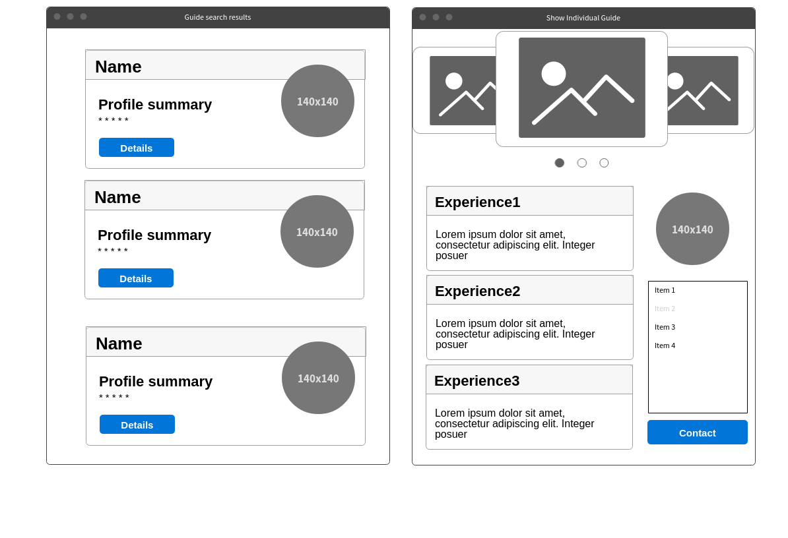
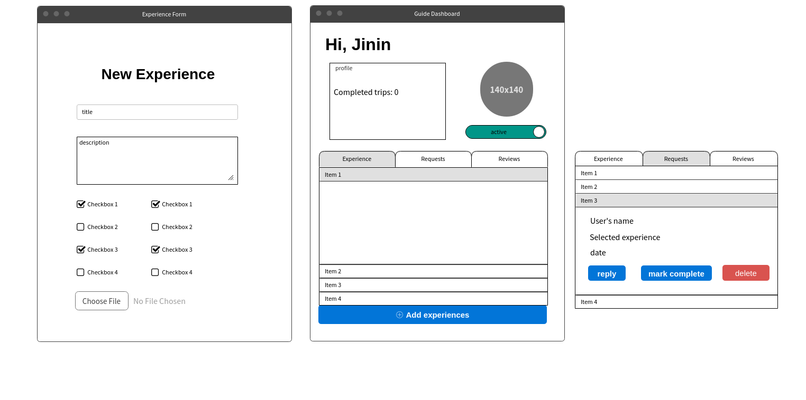
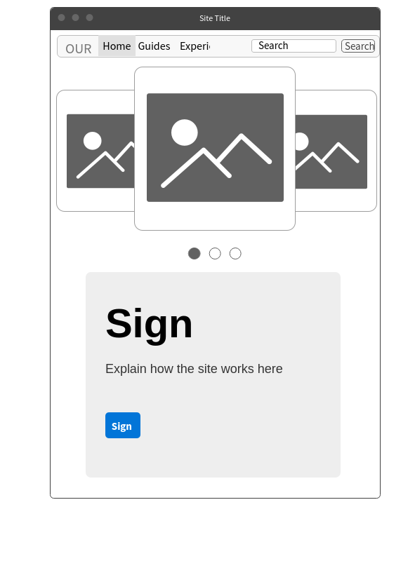
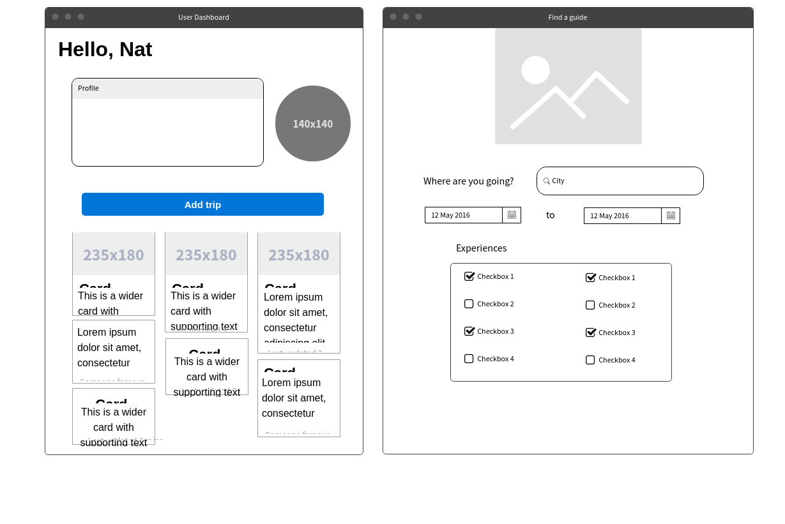
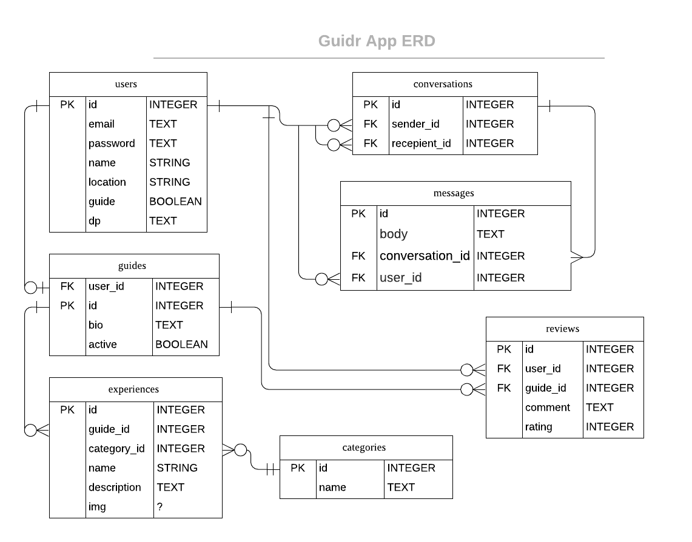

# Nat Jio
https://nat-jio.herokuapp.com/

## Technologies used
- Ruby
- Javascript
- HTML
- CSS
- Rails 
- PostgreSQL
- Sass
- Bootstrap
- Active Storage
- Websocket (Action Cable)
- JQuery
- Heroku
- Google Places API
- JQuery Raty

## Approach
- Ideation to generate travel app idea for solo travellers
- Identified Probems for the user and the user story
- Did Mockups and ERDs to determine how the site will look and how the data needs to be stored.
- Created WireFrames to track user flow depending on what type of user (Traveller or Guide)
- Built app, tested, and seeked feedback during soft launch.
- Add more features, test and debug.
- Collaboration on GitHub and deconflicting any issues.
- Deply on Heroku and GitHub

## Installation & Instructions
- Install Ruby & Rails (latest version)
- Install PostgreSQL
- Run Bundle Install
- Run db:create, db:migrate
- Run Rails server 

## User Experience
1. Problem Statement
- When you travel by yourself and want to have a genuine local experience in a country, but you don't know anyone in the city that you are going to. 
- You want to show off what your city has to offer and want to make friends with fellow wanderlust travellers. 

2. User Persona
- Solo Travellers (age: 21-40)
- Looking for a local experience and see attractions off the beaten track that only locals would know about.
- People who want to show off their city to others.

3. User Flow/ Stories
- Sign up as a User
- Search the destination you want to travel to and the type of experience you would like to have
- From a list of guides in that area, start chatting and arrange a meet up. 
- Once done with the experience, leave a review for the guide that you met.
- Sign up as a guide, add experiences that you want to offer, wait for users to initiate chats for you to bring them around. 

## Wireframes

## ERD

